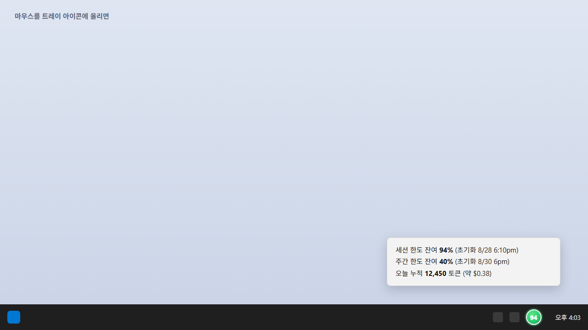
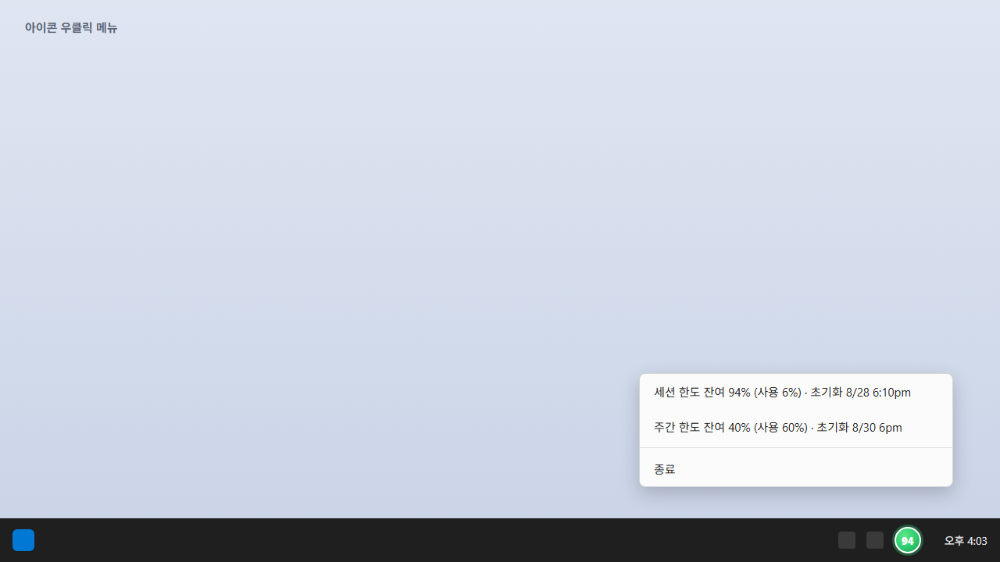
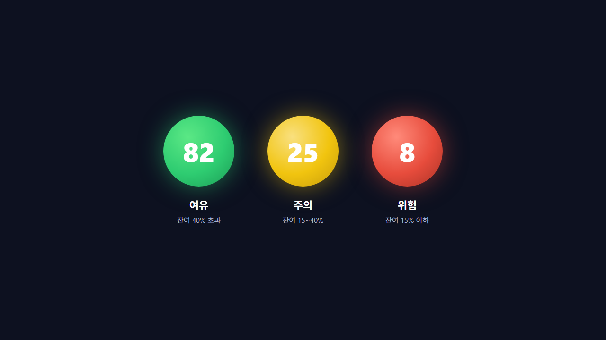
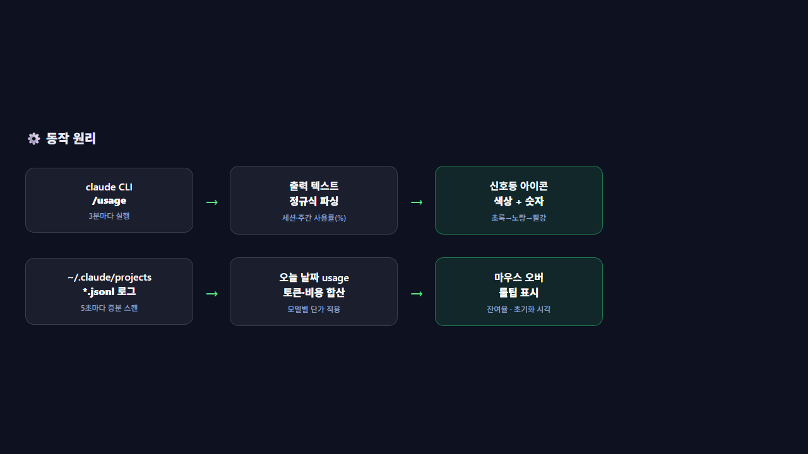

# 🚦 토큰 신호등 (Token Traffic Light)

Windows 작업표시줄 / macOS 메뉴 막대의 알림영역(시계 옆)에 신호등 모양 아이콘으로 **Claude Code 실제 사용 한도**를 실시간으로 보여주는 트레이 모니터입니다. Windows용(`token_tray_monitor_windows.pyw`)과 macOS용(`token_tray_monitor_mac.py`) 두 가지 버전을 제공합니다.


## 해결하고자 한 문제

Claude Code를 쓰다 보면 세션(5시간)·주간 사용량이 얼마나 남았는지 알 수 없어서, 작업 도중 갑자기 한도에 걸려 흐름이 끊기는 경우가 많습니다. 매번 `/usage` 명령을 직접 쳐야만 확인할 수 있어 불편했고, 특히 긴 작업을 이어가는 중에는 언제 한도에 다다를지 예측이 어려웠습니다.

## 어떻게 동작하나요

- **신호등 색깔/숫자**: 실제 계정의 **세션(5시간) 한도 잔여율**(초록 → 노랑 → 빨강, 가운데 숫자가 잔여 %)
- **마우스를 아이콘에 올리면**: 세션 한도 잔여 %, 주간 한도 잔여 %, 오늘 하루 누적 토큰/비용 추정치
- **아이콘 우클릭**: 세션 한도·주간 한도 잔여율을 사용/초기화 시각까지 자세히 보여주는 메뉴

세션/주간 한도 수치는 `claude` CLI의 `/usage` 명령을 3분마다 조용히 실행해서 가져옵니다 (모델을 호출하지 않는 로컬 명령이라 토큰이나 비용이 들지 않습니다). 오늘 누적 토큰/비용은 `~/.claude/projects` 안의 로컬 로그 파일(JSONL)을 5초마다 읽어 집계합니다.

| 트레이 아이콘 + 툴팁 | 우클릭 메뉴 |
|---|---|
|  |  |

| 신호등 3단계 | 동작 원리 |
|---|---|
|  |  |

## AI 활용 방식 및 결과

Claude Code를 활용해 Windows 작업표시줄에 상시 떠 있는 신호등 모양 트레이 아이콘 프로그램을 설계·구현했습니다. 5초마다 로컬 세션 로그(JSONL)를 읽어 오늘 누적 토큰/비용을 집계하고, 3분마다 Claude CLI의 `/usage` 결과를 정규식으로 파싱해 세션(5시간)·주간 한도 잔여율을 실제 계정 기준으로 계산합니다. 잔여율에 따라 초록→노랑→빨강 신호등 색과 숫자를 아이콘에 실시간 렌더링하고, 마우스를 올리면 세션/주간 잔여율·초기화 시각·오늘 누적 토큰/비용을 보여줍니다.

그 결과 별도 명령 없이 한눈에 한도 임박 여부를 확인할 수 있게 되어, 작업 중 갑작스러운 한도 도달로 흐름이 끊기는 일을 크게 줄였습니다.

## 사용 기술

- Python 3, [pystray](https://github.com/moses-palmer/pystray) (트레이 아이콘), Pillow (아이콘 렌더링)
- 데이터 출처: `claude` CLI의 `/usage` 명령 + `~/.claude/projects/**/*.jsonl` 로컬 로그
- **Claude Code**로 설계·구현

## 설치 및 실행

### Windows

```bash
python -m pip install pystray Pillow
```

이 폴더에서 `token_tray_monitor_windows.pyw`를 더블클릭하면 검은 콘솔창 없이 조용히 실행되고, 작업표시줄 알림영역에 신호등 아이콘이 나타납니다.

### macOS

> macOS는 `.pyw`/`.py` 파일에 대한 더블클릭 실행 연결이 없어서, Windows용 파일을 그대로 더블클릭하면 아무 반응이 없습니다. macOS에서는 아래 macOS 전용 버전을 사용하세요.

```bash
pip3 install pystray Pillow
```

(macOS에서는 `pip install pystray`만 해도 pyobjc 관련 macOS 백엔드 의존성이 함께 설치됩니다.)

이 폴더에서 `run_mac.command`를 더블클릭하면(최초 1회 "확인되지 않은 개발자" 경고가 뜨면 우클릭 → 열기) 필요한 패키지를 자동 설치하고 메뉴 막대에 신호등 아이콘을 띄웁니다. 터미널에서 직접 실행하려면:

```bash
python3 token_tray_monitor_mac.py
```

### 공통

`claude` CLI가 PATH에 있고 로그인되어 있어야 세션/주간 한도가 표시됩니다.

끄고 싶을 때: 아이콘 우클릭(macOS는 클릭) → 종료

## 참고

- 컨텍스트 %, 갱신 주기, 모델별 단가 등은 각 스크립트(`token_tray_monitor_windows.pyw` / `token_tray_monitor_mac.py`) 상단 설정값에서 조정할 수 있습니다.
- 비용($)은 추정치이며 실제 청구서와 다를 수 있습니다.
- 인터넷 접속이나 별도 API 키 없이, 로컬 `claude` CLI와 로그 파일만으로 동작합니다.
